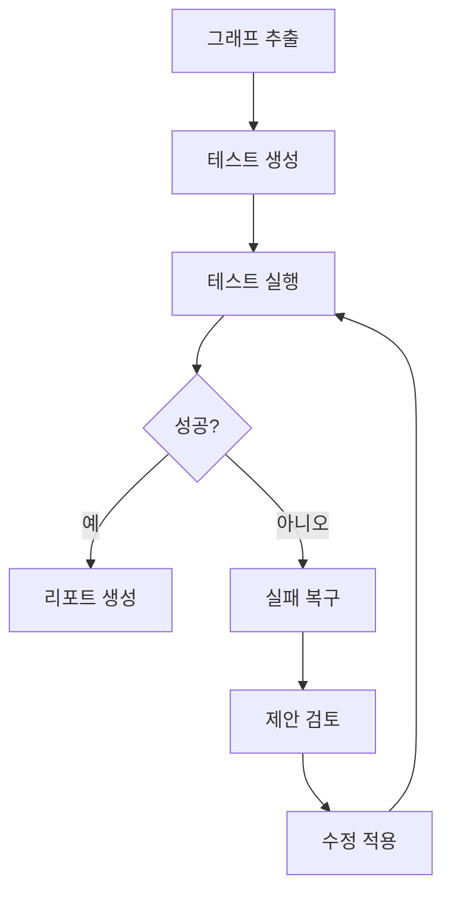
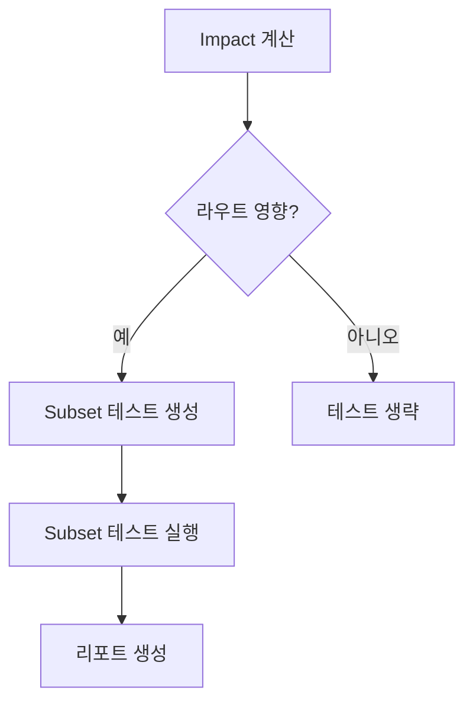
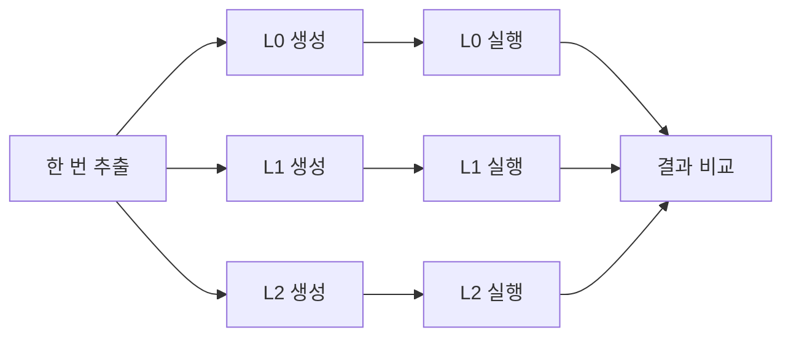
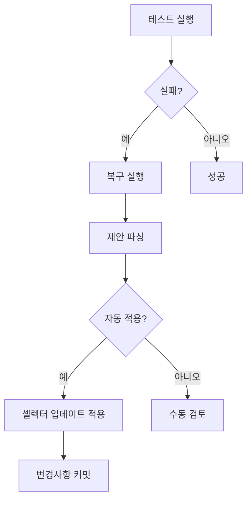

# ATE MCP 통합 가이드

**AI 기반 E2E 테스팅을 위한 ATE (Automation Test Engine)와 MCP (Model Context Protocol) 통합 완벽 가이드**

---

## 목차

- [빠른 시작](#빠른-시작)
- [MCP 도구 레퍼런스](#mcp-도구-레퍼런스)
- [워크플로우 예제](#워크플로우-예제)
- [사용 사례](#사용-사례)
- [베스트 프랙티스](#베스트-프랙티스)
- [CI/CD 통합](#cicd-통합)
- [트러블슈팅](#트러블슈팅)
- [성능 최적화](#성능-최적화)

---

## 빠른 시작

### 1. ATE 설치

```bash
bun add -d @mandujs/ate @playwright/test playwright
bunx playwright install chromium
```

### 2. MCP 서버 설정

`.mcp.json` 또는 `.claude.json`에 추가:

```json
{
  "mcpServers": {
    "mandu": {
      "command": "bunx",
      "args": ["@mandujs/mcp"],
      "cwd": "/path/to/your/project"
    }
  }
}
```

### 3. 첫 테스트 실행

```typescript
// Claude Code 또는 MCP 클라이언트에서

// 1단계: 상호작용 그래프 추출
await mandu.ate.extract({
  repoRoot: process.cwd(),
  routeGlobs: ["app/**/page.tsx"]
});

// 2단계: 테스트 시나리오 생성
mandu.ate.generate({
  repoRoot: process.cwd(),
  oracleLevel: "L1"
});

// 3단계: 테스트 실행 (개발 서버가 실행 중이어야 함)
const result = await mandu.ate.run({
  repoRoot: process.cwd(),
  baseURL: "http://localhost:3333"
});

// 4단계: 리포트 생성
await mandu.ate.report({
  repoRoot: process.cwd(),
  runId: result.runId,
  startedAt: result.startedAt,
  finishedAt: result.finishedAt,
  exitCode: result.exitCode,
  oracleLevel: "L1"
});
```

---

## MCP 도구 레퍼런스

### 핵심 도구

#### `mandu.ate.extract`

**목적**: 정적 분석(ts-morph)을 사용하여 코드베이스에서 상호작용 그래프를 추출합니다.

**파라미터**:

```typescript
{
  repoRoot: string;           // 프로젝트 루트 경로 (필수)
  tsconfigPath?: string;      // tsconfig.json 경로 (선택)
  routeGlobs?: string[];      // 라우트 파일 패턴 (기본: ["app/**/page.tsx"])
  buildSalt?: string;         // Build ID (기본: "dev")
}
```

**반환값**:

```typescript
{
  ok: true;
  graphPath: string;          // .mandu/interaction-graph.json
  summary: {
    nodes: number;            // 노드 수 (라우트, 모달, 액션)
    edges: number;            // 엣지 수 (navigate, openModal, runAction)
  };
}
```

**예제**:

```typescript
const result = await mandu.ate.extract({
  repoRoot: "/workspace/my-app",
  routeGlobs: ["app/**/page.tsx", "routes/**/page.tsx"]
});

console.log(`추출된 노드: ${result.summary.nodes}개, 엣지: ${result.summary.edges}개`);
```

**지원 패턴**:
- `<Link href="/path">` (Next.js Link)
- `<ManduLink to="/path">` (Mandu Link)
- `mandu.navigate("/path")`
- `mandu.modal.open("modalName")`
- `mandu.action.run("actionName")`

---

#### `mandu.ate.generate`

**목적**: 상호작용 그래프로부터 테스트 시나리오와 Playwright 스펙 파일을 생성합니다.

**파라미터**:

```typescript
{
  repoRoot: string;           // 프로젝트 루트 경로 (필수)
  oracleLevel?: "L0" | "L1" | "L2" | "L3";  // Oracle 레벨 (기본: "L1")
  onlyRoutes?: string[];      // 특정 라우트만 테스트 생성 (선택)
}
```

**반환값**:

```typescript
{
  ok: true;
  scenariosPath: string;      // .mandu/scenarios.json
  generatedSpecs: string[];   // tests/e2e/auto/*.spec.ts
}
```

**예제**:

```typescript
// 모든 라우트에 대해 L1 oracle로 테스트 생성
mandu.ate.generate({
  repoRoot: process.cwd(),
  oracleLevel: "L1"
});

// 특정 라우트만 테스트 생성
mandu.ate.generate({
  repoRoot: process.cwd(),
  oracleLevel: "L1",
  onlyRoutes: ["/", "/about", "/dashboard"]
});
```

**Oracle 레벨**:

| 레벨 | 설명 | 검증 항목 |
|------|------|-----------|
| **L0** | 기본 | ✅ `console.error` 없음<br>✅ uncaught exception 없음<br>✅ 5xx 응답 없음 |
| **L1** | 구조 | L0 + ✅ `<main>` 요소 존재 |
| **L2** | 동작 | L1 + ✅ URL 패턴 일치 |
| **L3** | 도메인 | L2 + ✅ 커스텀 도메인별 검증 |

---

#### `mandu.ate.run`

**목적**: Playwright 테스트를 실행하고 artifact를 수집합니다.

**파라미터**:

```typescript
{
  repoRoot: string;           // 프로젝트 루트 경로 (필수)
  baseURL?: string;           // Base URL (기본: "http://localhost:3333")
  ci?: boolean;               // CI 모드 (trace, video 활성화)
  headless?: boolean;         // Headless 브라우저 (기본: true)
  browsers?: Array<"chromium" | "firefox" | "webkit">;  // 테스트할 브라우저
}
```

**반환값**:

```typescript
{
  ok: boolean;                // exitCode === 0
  runId: string;              // run-1234567890
  reportDir: string;          // .mandu/reports/run-1234567890
  exitCode: number;           // 0 = 성공, 1 = 실패
  jsonReportPath?: string;    // playwright-report.json
  junitPath?: string;         // junit.xml
  startedAt: string;          // ISO 8601
  finishedAt: string;         // ISO 8601
}
```

**예제**:

```typescript
// 로컬 개발
const result = await mandu.ate.run({
  repoRoot: process.cwd(),
  baseURL: "http://localhost:3000",
  headless: false  // 브라우저 UI 표시
});

// CI 환경
const result = await mandu.ate.run({
  repoRoot: process.cwd(),
  baseURL: process.env.BASE_URL,
  ci: true,
  browsers: ["chromium", "firefox"]
});
```

---

#### `mandu.ate.report`

**목적**: 테스트 실행 결과를 요약한 리포트를 생성합니다.

**파라미터**:

```typescript
{
  repoRoot: string;           // 프로젝트 루트 경로 (필수)
  runId: string;              // ateRun의 runId (필수)
  startedAt: string;          // ISO 8601 시작 시간 (필수)
  finishedAt: string;         // ISO 8601 종료 시간 (필수)
  exitCode: number;           // ateRun의 exit code (필수)
  oracleLevel?: "L0" | "L1" | "L2" | "L3";  // Oracle 레벨 (기본: "L1")
  impact?: {
    mode: "full" | "subset";
    changedFiles: string[];
    selectedRoutes: string[];
  };
}
```

**반환값**:

```typescript
{
  ok: true;
  summaryPath: string;        // .mandu/reports/run-XXX/summary.json
  summary: {
    ok: boolean;
    runId: string;
    startedAt: string;
    finishedAt: string;
    durationMs: number;
    oracleLevel: string;
    // ... 상세 테스트 결과
  };
}
```

**예제**:

```typescript
const report = await mandu.ate.report({
  repoRoot: process.cwd(),
  runId: result.runId,
  startedAt: result.startedAt,
  finishedAt: result.finishedAt,
  exitCode: result.exitCode,
  oracleLevel: "L1"
});

console.log(`리포트 저장 위치: ${report.summaryPath}`);
```

---

#### `mandu.ate.heal`

**목적**: 실패한 테스트를 분석하고 대체 셀렉터를 제안합니다.

**파라미터**:

```typescript
{
  repoRoot: string;           // 프로젝트 루트 경로 (필수)
  runId: string;              // ateRun의 runId (필수)
}
```

**반환값**:

```typescript
{
  ok: true;
  attempted: true;
  suggestions: Array<{
    kind: "selector-map" | "test-code" | "note";
    title: string;
    diff: string;             // Unified diff 형식
    metadata?: {
      selector?: string;
      alternatives?: string[];
      testFile?: string;
    };
  }>;
}
```

**예제**:

```typescript
const healing = mandu.ate.heal({
  repoRoot: process.cwd(),
  runId: "run-1234567890"
});

healing.suggestions.forEach(s => {
  console.log(`[${s.kind}] ${s.title}`);
  console.log(s.diff);
});
```

**샘플 출력**:

```diff
[selector-map] selector-map 업데이트: button.submit
--- a/.mandu/selector-map.json
+++ b/.mandu/selector-map.json
@@ -1,3 +1,8 @@
 {
+  "button.submit": {
+    "fallbacks": [
+      "button[type='submit']",
+      "[data-testid='submit-button']"
+    ]
+  },
   "version": "1.0.0"
 }
```

---

#### `mandu.ate.impact`

**목적**: git diff를 기반으로 영향받는 라우트를 계산합니다 (Subset Testing).

**파라미터**:

```typescript
{
  repoRoot: string;           // 프로젝트 루트 경로 (필수)
  base?: string;              // Git base ref (기본: "HEAD~1")
  head?: string;              // Git head ref (기본: "HEAD")
}
```

**반환값**:

```typescript
{
  ok: true;
  changedFiles: string[];     // 변경된 파일 경로
  selectedRoutes: string[];   // 영향받는 라우트 ID
}
```

**예제**:

```typescript
// 현재 브랜치와 main 비교
const impact = mandu.ate.impact({
  repoRoot: process.cwd(),
  base: "main",
  head: "HEAD"
});

console.log(`변경된 파일: ${impact.changedFiles.length}개`);
console.log(`영향받는 라우트: ${impact.selectedRoutes.join(", ")}`);

// 영향받는 라우트만 테스트 생성
mandu.ate.generate({
  repoRoot: process.cwd(),
  onlyRoutes: impact.selectedRoutes
});
```

---

## 워크플로우 예제

### 예제 1: 기본 전체 파이프라인



**코드**:

```typescript
// 1단계: 상호작용 그래프 추출
await mandu.ate.extract({
  repoRoot: process.cwd(),
  routeGlobs: ["app/**/page.tsx"]
});

// 2단계: 테스트 시나리오 생성
mandu.ate.generate({
  repoRoot: process.cwd(),
  oracleLevel: "L1"
});

// 3단계: 테스트 실행
const result = await mandu.ate.run({
  repoRoot: process.cwd(),
  baseURL: "http://localhost:3000"
});

// 4단계: 리포트 생성
await mandu.ate.report({
  repoRoot: process.cwd(),
  runId: result.runId,
  startedAt: result.startedAt,
  finishedAt: result.finishedAt,
  exitCode: result.exitCode,
  oracleLevel: "L1"
});

// 5단계: 실패 시 복구
if (result.exitCode !== 0) {
  const healing = mandu.ate.heal({
    repoRoot: process.cwd(),
    runId: result.runId
  });

  console.log("복구 제안:");
  healing.suggestions.forEach(s => console.log(s.diff));
}
```

---

### 예제 2: Impact 분석 기반 Subset 테스팅



**코드**:

```typescript
// 1단계: git diff로 impact 계산
const impact = mandu.ate.impact({
  repoRoot: process.cwd(),
  base: "main",
  head: "HEAD"
});

console.log(`변경된 파일: ${impact.changedFiles.length}개`);
console.log(`영향받는 라우트: ${impact.selectedRoutes.join(", ")}`);

// 영향받는 라우트가 없으면 테스트 생략
if (impact.selectedRoutes.length === 0) {
  console.log("영향받는 라우트가 없습니다. 테스트를 생략합니다.");
  return;
}

// 2단계: 영향받는 라우트만 테스트 생성
mandu.ate.generate({
  repoRoot: process.cwd(),
  oracleLevel: "L1",
  onlyRoutes: impact.selectedRoutes
});

// 3단계: Subset 테스트 실행
const result = await mandu.ate.run({
  repoRoot: process.cwd(),
  baseURL: "http://localhost:3000"
});

// 4단계: impact 메타데이터와 함께 리포트 생성
await mandu.ate.report({
  repoRoot: process.cwd(),
  runId: result.runId,
  startedAt: result.startedAt,
  finishedAt: result.finishedAt,
  exitCode: result.exitCode,
  oracleLevel: "L1",
  impact: {
    mode: "subset",
    changedFiles: impact.changedFiles,
    selectedRoutes: impact.selectedRoutes
  }
});
```

---

### 예제 3: 다중 Oracle 검증



**코드**:

```typescript
// 한 번 추출
await mandu.ate.extract({
  repoRoot: process.cwd()
});

const oracleLevels = ["L0", "L1", "L2"] as const;
const results = [];

for (const level of oracleLevels) {
  // 이 oracle 레벨로 테스트 생성
  mandu.ate.generate({
    repoRoot: process.cwd(),
    oracleLevel: level
  });

  // 테스트 실행
  const result = await mandu.ate.run({
    repoRoot: process.cwd(),
    baseURL: "http://localhost:3000"
  });

  // 리포트 생성
  const report = await mandu.ate.report({
    repoRoot: process.cwd(),
    runId: result.runId,
    startedAt: result.startedAt,
    finishedAt: result.finishedAt,
    exitCode: result.exitCode,
    oracleLevel: level
  });

  results.push({ level, exitCode: result.exitCode, report });
}

// 결과 비교
console.log("Oracle 비교:");
results.forEach(r => {
  console.log(`${r.level}: ${r.exitCode === 0 ? "✅ 통과" : "❌ 실패"}`);
});
```

---

### 예제 4: 자동 복구 워크플로우



**코드**:

```typescript
// 테스트 실행
const result = await mandu.ate.run({
  repoRoot: process.cwd(),
  baseURL: "http://localhost:3000"
});

if (result.exitCode !== 0) {
  // 실패한 테스트 복구
  const healing = mandu.ate.heal({
    repoRoot: process.cwd(),
    runId: result.runId
  });

  // selector-map 업데이트 자동 적용
  for (const suggestion of healing.suggestions) {
    if (suggestion.kind === "selector-map") {
      console.log(`적용 중: ${suggestion.title}`);

      // 셀렉터 업데이트 파싱 및 적용
      const selectorMapPath = `${process.cwd()}/.mandu/selector-map.json`;
      const selectorMap = JSON.parse(await Bun.file(selectorMapPath).text());

      if (suggestion.metadata?.selector && suggestion.metadata?.alternatives) {
        selectorMap[suggestion.metadata.selector] = {
          fallbacks: suggestion.metadata.alternatives
        };
      }

      await Bun.write(selectorMapPath, JSON.stringify(selectorMap, null, 2));
      console.log(`✅ ${selectorMapPath} 업데이트됨`);
    }
  }

  // 복구된 셀렉터로 재실행
  const retryResult = await mandu.ate.run({
    repoRoot: process.cwd(),
    baseURL: "http://localhost:3000"
  });

  console.log(`재실행 결과: ${retryResult.exitCode === 0 ? "✅ 통과" : "❌ 실패"}`);
}
```

---

## 사용 사례

### 사례 1: 이커머스 사이트

**시나리오**: 새로운 결제 수단 추가 후 체크아웃 플로우 테스트

```typescript
// 1단계: 그래프 추출 (체크아웃 라우트 포함)
await mandu.ate.extract({
  repoRoot: process.cwd(),
  routeGlobs: ["app/**/page.tsx"]
});

// 2단계: Impact 분석
const impact = mandu.ate.impact({
  repoRoot: process.cwd(),
  base: "main",
  head: "feature/new-payment"
});

// 체크아웃 라우트 영향 확인
const checkoutRoutes = impact.selectedRoutes.filter(r =>
  r.includes("checkout") || r.includes("payment")
);

console.log(`영향받는 체크아웃 라우트: ${checkoutRoutes.join(", ")}`);

// 3단계: 체크아웃 플로우 테스트 생성
mandu.ate.generate({
  repoRoot: process.cwd(),
  oracleLevel: "L1",
  onlyRoutes: checkoutRoutes
});

// 4단계: 테스트 실행
const result = await mandu.ate.run({
  repoRoot: process.cwd(),
  baseURL: "http://localhost:3000"
});
```

---

### 사례 2: 블로그 플랫폼

**시나리오**: 템플릿 리팩토링 후 모든 포스트 페이지 검증

```typescript
// 1단계: 포스트 라우트 추출
await mandu.ate.extract({
  repoRoot: process.cwd(),
  routeGlobs: ["app/blog/**/page.tsx"]
});

// 2단계: 모든 포스트에 L1 테스트 생성
mandu.ate.generate({
  repoRoot: process.cwd(),
  oracleLevel: "L1"
});

// 3단계: 브라우저별 병렬 실행
const browsers = ["chromium", "firefox", "webkit"];
const results = [];

for (const browser of browsers) {
  const result = await mandu.ate.run({
    repoRoot: process.cwd(),
    browsers: [browser],
    baseURL: "http://localhost:3000"
  });

  results.push({ browser, exitCode: result.exitCode });
}

// 크로스 브라우저 호환성 확인
const failed = results.filter(r => r.exitCode !== 0);
if (failed.length > 0) {
  console.error(`실패한 브라우저: ${failed.map(r => r.browser).join(", ")}`);
}
```

---

### 사례 3: 대시보드 SPA

**시나리오**: 대시보드 위젯 간 네비게이션 플로우 테스트

```typescript
// 1단계: 커스텀 라우트 패턴으로 추출
await mandu.ate.extract({
  repoRoot: process.cwd(),
  routeGlobs: [
    "app/dashboard/**/page.tsx",
    "app/widgets/**/page.tsx"
  ]
});

// 2단계: L2 테스트 생성 (동작 검증)
mandu.ate.generate({
  repoRoot: process.cwd(),
  oracleLevel: "L2"
});

// 3단계: 디버깅을 위해 headful 모드로 실행
const result = await mandu.ate.run({
  repoRoot: process.cwd(),
  baseURL: "http://localhost:3000",
  headless: false  // 브라우저 UI 표시
});

// 4단계: 네비게이션 실패 복구
if (result.exitCode !== 0) {
  const healing = mandu.ate.heal({
    repoRoot: process.cwd(),
    runId: result.runId
  });

  // 네비게이션 관련 제안만 필터링
  const navSuggestions = healing.suggestions.filter(s =>
    s.title.includes("navigate") || s.title.includes("link")
  );

  console.log("네비게이션 복구 제안:");
  navSuggestions.forEach(s => console.log(s.diff));
}
```

---

### 사례 4: 멀티 테넌트 애플리케이션

**시나리오**: 설정 변경 후 테넌트별 라우트 테스트

```typescript
// 1단계: 테넌트별 라우트 추출
await mandu.ate.extract({
  repoRoot: process.cwd(),
  routeGlobs: ["app/[tenantId]/**/page.tsx"]
});

// 2단계: 테넌트 설정 변경에 대한 impact 계산
const impact = mandu.ate.impact({
  repoRoot: process.cwd(),
  base: "main",
  head: "HEAD"
});

// 테넌트 라우트 필터링
const tenantRoutes = impact.selectedRoutes.filter(r =>
  r.includes("[tenantId]")
);

// 3단계: 영향받는 테넌트 테스트 생성
mandu.ate.generate({
  repoRoot: process.cwd(),
  oracleLevel: "L1",
  onlyRoutes: tenantRoutes
});

// 4단계: 여러 테넌트 URL로 테스트 실행
const tenants = ["tenant-a", "tenant-b", "tenant-c"];
const results = [];

for (const tenant of tenants) {
  const result = await mandu.ate.run({
    repoRoot: process.cwd(),
    baseURL: `http://${tenant}.localhost:3000`
  });

  const report = await mandu.ate.report({
    repoRoot: process.cwd(),
    runId: result.runId,
    startedAt: result.startedAt,
    finishedAt: result.finishedAt,
    exitCode: result.exitCode,
    oracleLevel: "L1"
  });

  results.push({ tenant, exitCode: result.exitCode, report });
}

// 요약
console.log("테넌트 테스트 결과:");
results.forEach(r => {
  console.log(`${r.tenant}: ${r.exitCode === 0 ? "✅" : "❌"}`);
});
```

---

## 베스트 프랙티스

### Oracle 레벨 선택

**가이드라인**: 위험도와 커버리지 요구사항에 따라 oracle 레벨을 선택합니다.

| 시나리오 | 권장 레벨 | 이유 |
|----------|-----------|------|
| **모든 PR** | L0 | 빠른 스모크 테스트, 크래시 감지 |
| **나이틀리 빌드** | L1 | 구조 검증, 합리적인 커버리지 |
| **릴리스 후보** | L2 | 동작 검증, 종합적 |
| **중요 페이지** | L3 | 도메인별 검증, 수동 |

**예제**:

```typescript
// PR 체크: L0 (빠름)
if (process.env.CI_EVENT === "pull_request") {
  mandu.ate.generate({ repoRoot: process.cwd(), oracleLevel: "L0" });
}

// 나이틀리: L1 (종합적)
if (process.env.CI_EVENT === "schedule") {
  mandu.ate.generate({ repoRoot: process.cwd(), oracleLevel: "L1" });
}

// 릴리스: L2 (철저)
if (process.env.CI_EVENT === "release") {
  mandu.ate.generate({ repoRoot: process.cwd(), oracleLevel: "L2" });
}
```

---

### Impact 분석 전략

**Subset 테스팅을 사용할 때**:

✅ **Subset 테스팅 사용**:
- 대규모 코드베이스 (100개 이상 라우트)
- 빈번한 소규모 PR
- CI 시간 예산 제약
- 피처 브랜치 테스트

❌ **전체 테스팅 사용**:
- 릴리스 후보
- 메인 브랜치 머지
- 인프라 변경
- 의존성 업데이트

**예제**:

```typescript
const impact = mandu.ate.impact({
  repoRoot: process.cwd(),
  base: "main",
  head: "HEAD"
});

// 30% 미만의 라우트가 영향받으면 subset 사용
const useSubset = impact.selectedRoutes.length < (allRoutes.length * 0.3);

if (useSubset) {
  console.log(`Subset 테스팅 사용: ${impact.selectedRoutes.length}개 라우트`);
  mandu.ate.generate({
    repoRoot: process.cwd(),
    onlyRoutes: impact.selectedRoutes
  });
} else {
  console.log("전체 테스팅 사용: 모든 라우트");
  mandu.ate.generate({
    repoRoot: process.cwd()
  });
}
```

---

### 복구 워크플로우

**베스트 프랙티스**:

1. **적용 전 검토**: 복구 제안을 항상 수동으로 검토
2. **별도 커밋**: 복구 변경사항을 자동 커밋하지 않음
3. **복구 후 테스트**: 수정 사항을 검증하기 위해 재실행
4. **False Positive 추적**: 시간 경과에 따른 복구 정확도 모니터링

**예제**:

```typescript
// 1단계: 테스트 실행
const result = await mandu.ate.run({ repoRoot: process.cwd() });

if (result.exitCode !== 0) {
  // 2단계: 복구 제안 생성
  const healing = mandu.ate.heal({
    repoRoot: process.cwd(),
    runId: result.runId
  });

  // 3단계: 수동 검토를 위한 제안 저장
  await Bun.write(
    `.mandu/reports/${result.runId}/healing-suggestions.json`,
    JSON.stringify(healing.suggestions, null, 2)
  );

  console.log(`복구 제안이 저장되었습니다. 수동으로 검토하고 적용하세요.`);
  console.log(`파일: .mandu/reports/${result.runId}/healing-suggestions.json`);

  // 4단계: (수동) 선택한 제안 검토 및 적용
  // 5단계: 검증을 위해 재실행
}
```

---

### 성능 최적화

**전략**:

1. **상호작용 그래프 캐싱**: 한 번 추출, 여러 번 생성
2. **병렬 실행**: Playwright worker 사용
3. **Headless 모드**: CI에서 브라우저 UI 비활성화
4. **Subset 테스팅**: 대규모 코드베이스에 impact 분석
5. **브라우저 선택**: PR 체크에서 중요 브라우저만 테스트

**예제**:

```typescript
// playwright.config.ts
export default defineConfig({
  workers: process.env.CI ? 2 : 4,  // 병렬 worker
  use: {
    headless: process.env.CI === "true",
    trace: process.env.CI === "true" ? "on-first-retry" : "off",
    video: process.env.CI === "true" ? "retain-on-failure" : "off"
  },
  projects: [
    { name: "chromium", use: { ...devices["Desktop Chrome"] } },
    // 메인 브랜치에서만 Firefox/Safari 테스트
    ...(process.env.CI_BRANCH === "main" ? [
      { name: "firefox", use: { ...devices["Desktop Firefox"] } },
      { name: "webkit", use: { ...devices["Desktop Safari"] } }
    ] : [])
  ]
});
```

---

## CI/CD 통합

### GitHub Actions

```yaml
name: ATE E2E 테스트

on:
  pull_request:
  push:
    branches: [main]
  schedule:
    - cron: "0 0 * * *"  # 매일 밤

jobs:
  test:
    runs-on: ubuntu-latest

    steps:
      - uses: actions/checkout@v3

      - uses: oven-sh/setup-bun@v1
        with:
          bun-version: latest

      - name: 의존성 설치
        run: bun install

      - name: Playwright 브라우저 설치
        run: bunx playwright install chromium

      - name: 개발 서버 시작
        run: bun run dev &
        env:
          PORT: 3333

      - name: 서버 대기
        run: npx wait-on http://localhost:3333

      - name: 상호작용 그래프 추출
        run: |
          bun run -e "
            import { ateExtract } from '@mandujs/ate';
            await ateExtract({ repoRoot: process.cwd() });
          "

      - name: Impact 계산 (PR만)
        if: github.event_name == 'pull_request'
        id: impact
        run: |
          ROUTES=$(bun run -e "
            import { ateImpact } from '@mandujs/ate';
            const impact = ateImpact({
              repoRoot: process.cwd(),
              base: 'origin/main',
              head: 'HEAD'
            });
            console.log(impact.selectedRoutes.join(','));
          ")
          echo "routes=$ROUTES" >> $GITHUB_OUTPUT

      - name: 테스트 생성
        run: |
          ROUTES="${{ steps.impact.outputs.routes }}"
          ORACLE_LEVEL="${{ github.event_name == 'schedule' && 'L1' || 'L0' }}"

          bun run -e "
            import { ateGenerate } from '@mandujs/ate';
            ateGenerate({
              repoRoot: process.cwd(),
              oracleLevel: '$ORACLE_LEVEL',
              onlyRoutes: '$ROUTES'.split(',').filter(Boolean)
            });
          "

      - name: 테스트 실행
        id: run
        run: |
          bun run -e "
            import { ateRun, ateReport } from '@mandujs/ate';

            const result = await ateRun({
              repoRoot: process.cwd(),
              baseURL: 'http://localhost:3333',
              ci: true
            });

            await ateReport({
              repoRoot: process.cwd(),
              runId: result.runId,
              startedAt: result.startedAt,
              finishedAt: result.finishedAt,
              exitCode: result.exitCode,
              oracleLevel: process.env.ORACLE_LEVEL || 'L0'
            });

            process.exit(result.exitCode);
          "

      - name: 실패한 테스트 복구
        if: failure()
        run: |
          bun run -e "
            import { ateHeal } from '@mandujs/ate';
            const healing = ateHeal({
              repoRoot: process.cwd(),
              runId: '${{ steps.run.outputs.runId }}'
            });
            console.log('복구 제안:', healing.suggestions.length);
          "

      - name: Playwright 리포트 업로드
        if: always()
        uses: actions/upload-artifact@v3
        with:
          name: playwright-report
          path: .mandu/reports/latest/
          retention-days: 30
```

---

### GitLab CI

```yaml
stages:
  - test

ate-tests:
  stage: test
  image: oven/bun:latest

  services:
    - name: playwright/browsers:chromium

  before_script:
    - bun install
    - bunx playwright install chromium

  script:
    - bun run dev &
    - npx wait-on http://localhost:3333

    # 추출
    - bun run -e "import { ateExtract } from '@mandujs/ate'; await ateExtract({ repoRoot: process.cwd() });"

    # 생성
    - bun run -e "import { ateGenerate } from '@mandujs/ate'; ateGenerate({ repoRoot: process.cwd(), oracleLevel: 'L1' });"

    # 실행
    - bun run -e "
        import { ateRun, ateReport } from '@mandujs/ate';
        const result = await ateRun({ repoRoot: process.cwd(), baseURL: 'http://localhost:3333', ci: true });
        await ateReport({ repoRoot: process.cwd(), runId: result.runId, startedAt: result.startedAt, finishedAt: result.finishedAt, exitCode: result.exitCode, oracleLevel: 'L1' });
        process.exit(result.exitCode);
      "

  artifacts:
    when: always
    paths:
      - .mandu/reports/latest/
    expire_in: 30 days
```

---

## 트러블슈팅

### 오류: "No interaction graph found"

**원인**: `ateExtract` 전에 `ateGenerate` 또는 `ateRun`이 호출됨.

**해결책**:

```typescript
// 항상 먼저 추출
await mandu.ate.extract({ repoRoot: process.cwd() });

// 그 다음 생성
mandu.ate.generate({ repoRoot: process.cwd() });
```

---

### 오류: "Playwright not found"

**원인**: Playwright가 설치되지 않음.

**해결책**:

```bash
bun add -d @playwright/test playwright
bunx playwright install chromium
```

---

### 오류: "Base URL not responding"

**원인**: 개발 서버가 실행되지 않음.

**해결책**:

```bash
# 먼저 서버 시작
bun run dev &

# 서버 대기
npx wait-on http://localhost:3333

# 그 다음 테스트 실행
bun run -e "import { ateRun } from '@mandujs/ate'; await ateRun({ repoRoot: process.cwd() });"
```

---

### 오류: "Selector timeout"

**원인**: 생성된 셀렉터가 오래됨.

**해결책**:

```typescript
// 1. 복구 실행
const healing = mandu.ate.heal({
  repoRoot: process.cwd(),
  runId: "run-XXX"
});

// 2. 제안 검토
healing.suggestions.forEach(s => console.log(s.diff));

// 3. 수동 또는 프로그래밍 방식으로 적용
```

---

### 오류: "Empty interaction graph"

**원인**: `routeGlobs` 패턴이 파일을 찾지 못함.

**해결책**:

```typescript
// glob 패턴 확인
await mandu.ate.extract({
  repoRoot: process.cwd(),
  routeGlobs: [
    "app/**/page.tsx",      // Next.js App Router
    "routes/**/page.tsx",   // Custom routes
    "src/pages/**/*.tsx"    // Pages directory
  ]
});
```

---

## 성능 최적화

### 1. 상호작용 그래프 캐싱

```bash
# 한 번 추출
bun run ate:extract

# 여러 번 생성/실행
bun run ate:generate
bun run ate:run
```

---

### 2. Subset 테스팅

```typescript
const impact = mandu.ate.impact({ repoRoot: process.cwd() });

if (impact.selectedRoutes.length < 10) {
  // Subset 테스팅 사용
  mandu.ate.generate({
    repoRoot: process.cwd(),
    onlyRoutes: impact.selectedRoutes
  });
}
```

---

### 3. 병렬 Worker

```typescript
// playwright.config.ts
export default defineConfig({
  workers: process.env.CI ? 2 : 4
});
```

---

### 4. Headless 모드

```typescript
await mandu.ate.run({
  repoRoot: process.cwd(),
  headless: true  // 빠른 실행
});
```

---

## 요약

**ATE MCP 통합**은 완전한 AI 기반 E2E 테스팅 워크플로우를 제공합니다:

1. **Extract**: 정적 분석 → 상호작용 그래프
2. **Generate**: 그래프 → Playwright 스펙
3. **Run**: 테스트 실행 → Artifact
4. **Report**: 결과 요약
5. **Heal**: 자동 수정 제안
6. **Impact**: Subset 테스팅

**주요 장점**:
- ✅ **Zero-config**: 코드에서 자동으로 테스트 생성
- ✅ **AI 친화적**: Claude Code용 MCP 도구
- ✅ **Self-healing**: 셀렉터 수정 자동 제안
- ✅ **효율적**: Impact 분석으로 Subset 테스팅
- ✅ **확장 가능**: 다중 oracle, 다중 브라우저 지원

**다음 단계**:
- [API 레퍼런스](../README.md#-api-reference)
- [Oracle 레벨](../README.md#-oracle-levels)
- [예제](../README.md#-examples)

---

**Mandu 팀이 ❤️로 만들었습니다**
