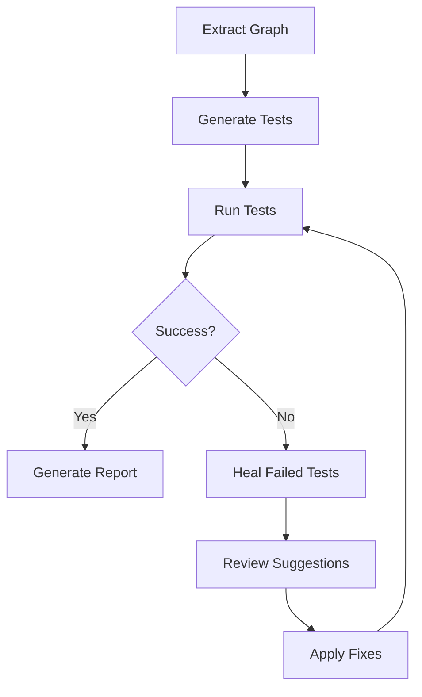
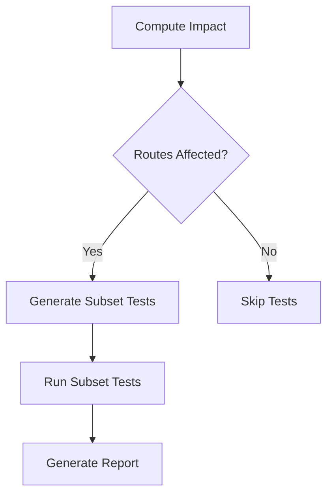
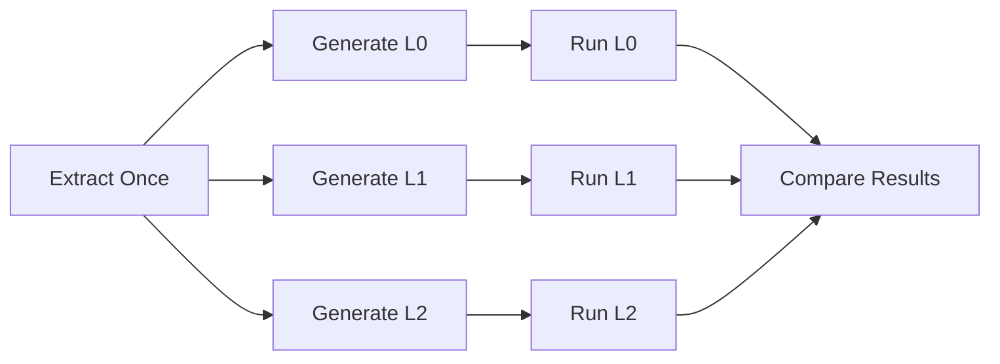
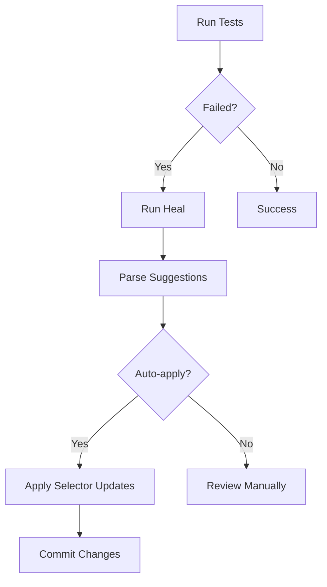

# ATE MCP Integration Guide

**Complete guide for using ATE (Automation Test Engine) with MCP (Model Context Protocol) for AI-driven E2E testing.**

---

## Table of Contents

- [Quick Start](#quick-start)
- [MCP Tools Reference](#mcp-tools-reference)
- [Workflow Examples](#workflow-examples)
- [Use Cases](#use-cases)
- [Best Practices](#best-practices)
- [CI/CD Integration](#cicd-integration)
- [Troubleshooting](#troubleshooting)
- [Performance Optimization](#performance-optimization)

---

## Quick Start

### 1. Install ATE

```bash
bun add -d @mandujs/ate @playwright/test playwright
bunx playwright install chromium
```

### 2. Setup MCP Server

Add to `.mcp.json` or `.claude.json`:

```json
{
  "mcpServers": {
    "mandu": {
      "command": "bunx",
      "args": ["@mandujs/mcp"],
      "cwd": "/path/to/your/project"
    }
  }
}
```

### 3. Run First Test

```typescript
// In Claude Code or any MCP client

// Step 1: Extract interaction graph
await mandu.ate.extract({
  repoRoot: process.cwd(),
  routeGlobs: ["app/**/page.tsx"]
});

// Step 2: Generate test scenarios
mandu.ate.generate({
  repoRoot: process.cwd(),
  oracleLevel: "L1"
});

// Step 3: Run tests (ensure dev server is running)
const result = await mandu.ate.run({
  repoRoot: process.cwd(),
  baseURL: "http://localhost:3333"
});

// Step 4: Generate report
await mandu.ate.report({
  repoRoot: process.cwd(),
  runId: result.runId,
  startedAt: result.startedAt,
  finishedAt: result.finishedAt,
  exitCode: result.exitCode,
  oracleLevel: "L1"
});
```

---

## MCP Tools Reference

### Core Tools

#### `mandu.ate.extract`

**Purpose**: Extract interaction graph from codebase using static analysis (ts-morph).

**Parameters**:

```typescript
{
  repoRoot: string;           // Project root path (required)
  tsconfigPath?: string;      // Path to tsconfig.json (optional)
  routeGlobs?: string[];      // Route file patterns (default: ["app/**/page.tsx"])
  buildSalt?: string;         // Build ID (default: "dev")
}
```

**Returns**:

```typescript
{
  ok: true;
  graphPath: string;          // .mandu/interaction-graph.json
  summary: {
    nodes: number;            // Number of nodes (routes, modals, actions)
    edges: number;            // Number of edges (navigate, openModal, runAction)
  };
}
```

**Example**:

```typescript
const result = await mandu.ate.extract({
  repoRoot: "/workspace/my-app",
  routeGlobs: ["app/**/page.tsx", "routes/**/page.tsx"]
});

console.log(`Extracted ${result.summary.nodes} nodes, ${result.summary.edges} edges`);
```

**Supported Patterns**:
- `<Link href="/path">` (Next.js Link)
- `<ManduLink to="/path">` (Mandu Link)
- `mandu.navigate("/path")`
- `mandu.modal.open("modalName")`
- `mandu.action.run("actionName")`

---

#### `mandu.ate.generate`

**Purpose**: Generate test scenarios and Playwright spec files from interaction graph.

**Parameters**:

```typescript
{
  repoRoot: string;           // Project root path (required)
  oracleLevel?: "L0" | "L1" | "L2" | "L3";  // Oracle level (default: "L1")
  onlyRoutes?: string[];      // Generate tests only for specific routes (optional)
}
```

**Returns**:

```typescript
{
  ok: true;
  scenariosPath: string;      // .mandu/scenarios.json
  generatedSpecs: string[];   // tests/e2e/auto/*.spec.ts
}
```

**Example**:

```typescript
// Generate tests for all routes with L1 oracle
mandu.ate.generate({
  repoRoot: process.cwd(),
  oracleLevel: "L1"
});

// Generate tests for specific routes only
mandu.ate.generate({
  repoRoot: process.cwd(),
  oracleLevel: "L1",
  onlyRoutes: ["/", "/about", "/dashboard"]
});
```

**Oracle Levels**:

| Level | Description | Assertions |
|-------|-------------|------------|
| **L0** | Baseline | ✅ No `console.error`<br>✅ No uncaught exceptions<br>✅ No 5xx responses |
| **L1** | Structure | L0 + ✅ `<main>` element exists |
| **L2** | Behavior | L1 + ✅ URL matches expected pattern |
| **L3** | Domain | L2 + ✅ Custom domain-specific assertions |

---

#### `mandu.ate.run`

**Purpose**: Execute Playwright tests and collect artifacts.

**Parameters**:

```typescript
{
  repoRoot: string;           // Project root path (required)
  baseURL?: string;           // Base URL (default: "http://localhost:3333")
  ci?: boolean;               // CI mode (enables trace, video)
  headless?: boolean;         // Headless browser (default: true)
  browsers?: Array<"chromium" | "firefox" | "webkit">;  // Browsers to test
}
```

**Returns**:

```typescript
{
  ok: boolean;                // exitCode === 0
  runId: string;              // run-1234567890
  reportDir: string;          // .mandu/reports/run-1234567890
  exitCode: number;           // 0 = pass, 1 = fail
  jsonReportPath?: string;    // playwright-report.json
  junitPath?: string;         // junit.xml
  startedAt: string;          // ISO 8601
  finishedAt: string;         // ISO 8601
}
```

**Example**:

```typescript
// Local development
const result = await mandu.ate.run({
  repoRoot: process.cwd(),
  baseURL: "http://localhost:3000",
  headless: false  // Show browser UI
});

// CI environment
const result = await mandu.ate.run({
  repoRoot: process.cwd(),
  baseURL: process.env.BASE_URL,
  ci: true,
  browsers: ["chromium", "firefox"]
});
```

---

#### `mandu.ate.report`

**Purpose**: Generate summary report from test run results.

**Parameters**:

```typescript
{
  repoRoot: string;           // Project root path (required)
  runId: string;              // Run ID from ateRun (required)
  startedAt: string;          // ISO 8601 start time (required)
  finishedAt: string;         // ISO 8601 finish time (required)
  exitCode: number;           // Exit code from ateRun (required)
  oracleLevel?: "L0" | "L1" | "L2" | "L3";  // Oracle level (default: "L1")
  impact?: {
    mode: "full" | "subset";
    changedFiles: string[];
    selectedRoutes: string[];
  };
}
```

**Returns**:

```typescript
{
  ok: true;
  summaryPath: string;        // .mandu/reports/run-XXX/summary.json
  summary: {
    ok: boolean;
    runId: string;
    startedAt: string;
    finishedAt: string;
    durationMs: number;
    oracleLevel: string;
    // ... detailed test results
  };
}
```

**Example**:

```typescript
const report = await mandu.ate.report({
  repoRoot: process.cwd(),
  runId: result.runId,
  startedAt: result.startedAt,
  finishedAt: result.finishedAt,
  exitCode: result.exitCode,
  oracleLevel: "L1"
});

console.log(`Report saved to: ${report.summaryPath}`);
```

---

#### `mandu.ate.heal`

**Purpose**: Analyze failed tests and suggest selector alternatives.

**Parameters**:

```typescript
{
  repoRoot: string;           // Project root path (required)
  runId: string;              // Run ID from ateRun (required)
}
```

**Returns**:

```typescript
{
  ok: true;
  attempted: true;
  suggestions: Array<{
    kind: "selector-map" | "test-code" | "note";
    title: string;
    diff: string;             // Unified diff format
    metadata?: {
      selector?: string;
      alternatives?: string[];
      testFile?: string;
    };
  }>;
}
```

**Example**:

```typescript
const healing = mandu.ate.heal({
  repoRoot: process.cwd(),
  runId: "run-1234567890"
});

healing.suggestions.forEach(s => {
  console.log(`[${s.kind}] ${s.title}`);
  console.log(s.diff);
});
```

**Sample Output**:

```diff
[selector-map] Update selector-map for: button.submit
--- a/.mandu/selector-map.json
+++ b/.mandu/selector-map.json
@@ -1,3 +1,8 @@
 {
+  "button.submit": {
+    "fallbacks": [
+      "button[type='submit']",
+      "[data-testid='submit-button']"
+    ]
+  },
   "version": "1.0.0"
 }
```

---

#### `mandu.ate.impact`

**Purpose**: Calculate affected routes based on git diff (subset testing).

**Parameters**:

```typescript
{
  repoRoot: string;           // Project root path (required)
  base?: string;              // Git base ref (default: "HEAD~1")
  head?: string;              // Git head ref (default: "HEAD")
}
```

**Returns**:

```typescript
{
  ok: true;
  changedFiles: string[];     // Changed file paths
  selectedRoutes: string[];   // Affected route IDs
}
```

**Example**:

```typescript
// Compare current branch with main
const impact = mandu.ate.impact({
  repoRoot: process.cwd(),
  base: "main",
  head: "HEAD"
});

console.log(`Changed files: ${impact.changedFiles.length}`);
console.log(`Affected routes: ${impact.selectedRoutes.join(", ")}`);

// Generate tests only for affected routes
mandu.ate.generate({
  repoRoot: process.cwd(),
  onlyRoutes: impact.selectedRoutes
});
```

---

## Workflow Examples

### Example 1: Basic Full Pipeline



**Code**:

```typescript
// Step 1: Extract interaction graph
await mandu.ate.extract({
  repoRoot: process.cwd(),
  routeGlobs: ["app/**/page.tsx"]
});

// Step 2: Generate test scenarios
mandu.ate.generate({
  repoRoot: process.cwd(),
  oracleLevel: "L1"
});

// Step 3: Run tests
const result = await mandu.ate.run({
  repoRoot: process.cwd(),
  baseURL: "http://localhost:3000"
});

// Step 4: Generate report
await mandu.ate.report({
  repoRoot: process.cwd(),
  runId: result.runId,
  startedAt: result.startedAt,
  finishedAt: result.finishedAt,
  exitCode: result.exitCode,
  oracleLevel: "L1"
});

// Step 5: Heal if failed
if (result.exitCode !== 0) {
  const healing = mandu.ate.heal({
    repoRoot: process.cwd(),
    runId: result.runId
  });

  console.log("Healing suggestions:");
  healing.suggestions.forEach(s => console.log(s.diff));
}
```

---

### Example 2: Subset Testing with Impact Analysis



**Code**:

```typescript
// Step 1: Compute impact from git diff
const impact = mandu.ate.impact({
  repoRoot: process.cwd(),
  base: "main",
  head: "HEAD"
});

console.log(`Changed files: ${impact.changedFiles.length}`);
console.log(`Affected routes: ${impact.selectedRoutes.join(", ")}`);

// Skip tests if no routes affected
if (impact.selectedRoutes.length === 0) {
  console.log("No routes affected, skipping tests");
  return;
}

// Step 2: Generate tests only for affected routes
mandu.ate.generate({
  repoRoot: process.cwd(),
  oracleLevel: "L1",
  onlyRoutes: impact.selectedRoutes
});

// Step 3: Run subset tests
const result = await mandu.ate.run({
  repoRoot: process.cwd(),
  baseURL: "http://localhost:3000"
});

// Step 4: Generate report with impact metadata
await mandu.ate.report({
  repoRoot: process.cwd(),
  runId: result.runId,
  startedAt: result.startedAt,
  finishedAt: result.finishedAt,
  exitCode: result.exitCode,
  oracleLevel: "L1",
  impact: {
    mode: "subset",
    changedFiles: impact.changedFiles,
    selectedRoutes: impact.selectedRoutes
  }
});
```

---

### Example 3: Multi-Oracle Validation



**Code**:

```typescript
// Extract once
await mandu.ate.extract({
  repoRoot: process.cwd()
});

const oracleLevels = ["L0", "L1", "L2"] as const;
const results = [];

for (const level of oracleLevels) {
  // Generate tests for this oracle level
  mandu.ate.generate({
    repoRoot: process.cwd(),
    oracleLevel: level
  });

  // Run tests
  const result = await mandu.ate.run({
    repoRoot: process.cwd(),
    baseURL: "http://localhost:3000"
  });

  // Generate report
  const report = await mandu.ate.report({
    repoRoot: process.cwd(),
    runId: result.runId,
    startedAt: result.startedAt,
    finishedAt: result.finishedAt,
    exitCode: result.exitCode,
    oracleLevel: level
  });

  results.push({ level, exitCode: result.exitCode, report });
}

// Compare results
console.log("Oracle comparison:");
results.forEach(r => {
  console.log(`${r.level}: ${r.exitCode === 0 ? "✅ PASS" : "❌ FAIL"}`);
});
```

---

### Example 4: Automated Healing Workflow



**Code**:

```typescript
// Run tests
const result = await mandu.ate.run({
  repoRoot: process.cwd(),
  baseURL: "http://localhost:3000"
});

if (result.exitCode !== 0) {
  // Heal failed tests
  const healing = mandu.ate.heal({
    repoRoot: process.cwd(),
    runId: result.runId
  });

  // Auto-apply selector-map updates
  for (const suggestion of healing.suggestions) {
    if (suggestion.kind === "selector-map") {
      console.log(`Applying: ${suggestion.title}`);

      // Parse and apply selector updates
      const selectorMapPath = `${process.cwd()}/.mandu/selector-map.json`;
      const selectorMap = JSON.parse(await Bun.file(selectorMapPath).text());

      if (suggestion.metadata?.selector && suggestion.metadata?.alternatives) {
        selectorMap[suggestion.metadata.selector] = {
          fallbacks: suggestion.metadata.alternatives
        };
      }

      await Bun.write(selectorMapPath, JSON.stringify(selectorMap, null, 2));
      console.log(`✅ Updated ${selectorMapPath}`);
    }
  }

  // Re-run tests with healed selectors
  const retryResult = await mandu.ate.run({
    repoRoot: process.cwd(),
    baseURL: "http://localhost:3000"
  });

  console.log(`Retry result: ${retryResult.exitCode === 0 ? "✅ PASS" : "❌ FAIL"}`);
}
```

---

## Use Cases

### Use Case 1: E-Commerce Site

**Scenario**: Test checkout flow after adding new payment method.

```typescript
// Step 1: Extract graph (includes checkout routes)
await mandu.ate.extract({
  repoRoot: process.cwd(),
  routeGlobs: ["app/**/page.tsx"]
});

// Step 2: Impact analysis
const impact = mandu.ate.impact({
  repoRoot: process.cwd(),
  base: "main",
  head: "feature/new-payment"
});

// Checkout routes affected?
const checkoutRoutes = impact.selectedRoutes.filter(r =>
  r.includes("checkout") || r.includes("payment")
);

console.log(`Checkout routes affected: ${checkoutRoutes.join(", ")}`);

// Step 3: Generate tests for checkout flow
mandu.ate.generate({
  repoRoot: process.cwd(),
  oracleLevel: "L1",
  onlyRoutes: checkoutRoutes
});

// Step 4: Run tests
const result = await mandu.ate.run({
  repoRoot: process.cwd(),
  baseURL: "http://localhost:3000"
});
```

---

### Use Case 2: Blog Platform

**Scenario**: Validate all post pages after template refactoring.

```typescript
// Step 1: Extract post routes
await mandu.ate.extract({
  repoRoot: process.cwd(),
  routeGlobs: ["app/blog/**/page.tsx"]
});

// Step 2: Generate L1 tests for all posts
mandu.ate.generate({
  repoRoot: process.cwd(),
  oracleLevel: "L1"
});

// Step 3: Run in parallel across browsers
const browsers = ["chromium", "firefox", "webkit"];
const results = [];

for (const browser of browsers) {
  const result = await mandu.ate.run({
    repoRoot: process.cwd(),
    browsers: [browser],
    baseURL: "http://localhost:3000"
  });

  results.push({ browser, exitCode: result.exitCode });
}

// Check cross-browser compatibility
const failed = results.filter(r => r.exitCode !== 0);
if (failed.length > 0) {
  console.error(`Failed browsers: ${failed.map(r => r.browser).join(", ")}`);
}
```

---

### Use Case 3: Dashboard SPA

**Scenario**: Test navigation flows between dashboard widgets.

```typescript
// Step 1: Extract with custom route patterns
await mandu.ate.extract({
  repoRoot: process.cwd(),
  routeGlobs: [
    "app/dashboard/**/page.tsx",
    "app/widgets/**/page.tsx"
  ]
});

// Step 2: Generate L2 tests (behavioral assertions)
mandu.ate.generate({
  repoRoot: process.cwd(),
  oracleLevel: "L2"
});

// Step 3: Run with headful mode for debugging
const result = await mandu.ate.run({
  repoRoot: process.cwd(),
  baseURL: "http://localhost:3000",
  headless: false  // Show browser UI
});

// Step 4: Heal navigation failures
if (result.exitCode !== 0) {
  const healing = mandu.ate.heal({
    repoRoot: process.cwd(),
    runId: result.runId
  });

  // Filter navigation-related suggestions
  const navSuggestions = healing.suggestions.filter(s =>
    s.title.includes("navigate") || s.title.includes("link")
  );

  console.log("Navigation healing suggestions:");
  navSuggestions.forEach(s => console.log(s.diff));
}
```

---

### Use Case 4: Multi-Tenant Application

**Scenario**: Test tenant-specific routes after configuration changes.

```typescript
// Step 1: Extract with tenant-specific routes
await mandu.ate.extract({
  repoRoot: process.cwd(),
  routeGlobs: ["app/[tenantId]/**/page.tsx"]
});

// Step 2: Compute impact for tenant config changes
const impact = mandu.ate.impact({
  repoRoot: process.cwd(),
  base: "main",
  head: "HEAD"
});

// Filter tenant routes
const tenantRoutes = impact.selectedRoutes.filter(r =>
  r.includes("[tenantId]")
);

// Step 3: Generate tests for affected tenants
mandu.ate.generate({
  repoRoot: process.cwd(),
  oracleLevel: "L1",
  onlyRoutes: tenantRoutes
});

// Step 4: Run tests against multiple tenant URLs
const tenants = ["tenant-a", "tenant-b", "tenant-c"];
const results = [];

for (const tenant of tenants) {
  const result = await mandu.ate.run({
    repoRoot: process.cwd(),
    baseURL: `http://${tenant}.localhost:3000`
  });

  const report = await mandu.ate.report({
    repoRoot: process.cwd(),
    runId: result.runId,
    startedAt: result.startedAt,
    finishedAt: result.finishedAt,
    exitCode: result.exitCode,
    oracleLevel: "L1"
  });

  results.push({ tenant, exitCode: result.exitCode, report });
}

// Summary
console.log("Tenant test results:");
results.forEach(r => {
  console.log(`${r.tenant}: ${r.exitCode === 0 ? "✅" : "❌"}`);
});
```

---

## Best Practices

### Oracle Level Selection

**Guideline**: Choose oracle level based on risk and coverage needs.

| Scenario | Recommended Level | Rationale |
|----------|-------------------|-----------|
| **Every PR** | L0 | Fast smoke test, catches crashes |
| **Nightly builds** | L1 | Structure validation, reasonable coverage |
| **Release candidates** | L2 | Behavioral validation, comprehensive |
| **Critical pages** | L3 | Domain-specific assertions, manual |

**Example**:

```typescript
// PR checks: L0 (fast)
if (process.env.CI_EVENT === "pull_request") {
  mandu.ate.generate({ repoRoot: process.cwd(), oracleLevel: "L0" });
}

// Nightly: L1 (comprehensive)
if (process.env.CI_EVENT === "schedule") {
  mandu.ate.generate({ repoRoot: process.cwd(), oracleLevel: "L1" });
}

// Release: L2 (thorough)
if (process.env.CI_EVENT === "release") {
  mandu.ate.generate({ repoRoot: process.cwd(), oracleLevel: "L2" });
}
```

---

### Impact Analysis Strategy

**When to use subset testing**:

✅ **Use subset testing when**:
- Large codebase (100+ routes)
- Frequent small PRs
- CI time budget constraints
- Feature branch testing

❌ **Use full testing when**:
- Release candidates
- Main branch merges
- Infrastructure changes
- Dependency updates

**Example**:

```typescript
const impact = mandu.ate.impact({
  repoRoot: process.cwd(),
  base: "main",
  head: "HEAD"
});

// Use subset if less than 30% routes affected
const useSubset = impact.selectedRoutes.length < (allRoutes.length * 0.3);

if (useSubset) {
  console.log(`Using subset testing: ${impact.selectedRoutes.length} routes`);
  mandu.ate.generate({
    repoRoot: process.cwd(),
    onlyRoutes: impact.selectedRoutes
  });
} else {
  console.log("Using full testing: all routes");
  mandu.ate.generate({
    repoRoot: process.cwd()
  });
}
```

---

### Healing Workflow

**Best practices**:

1. **Review before applying**: Always review healing suggestions manually
2. **Commit separately**: Don't auto-commit healing changes
3. **Test after healing**: Re-run tests to validate fixes
4. **Track false positives**: Monitor healing accuracy over time

**Example**:

```typescript
// Step 1: Run tests
const result = await mandu.ate.run({ repoRoot: process.cwd() });

if (result.exitCode !== 0) {
  // Step 2: Generate healing suggestions
  const healing = mandu.ate.heal({
    repoRoot: process.cwd(),
    runId: result.runId
  });

  // Step 3: Save suggestions for manual review
  await Bun.write(
    `.mandu/reports/${result.runId}/healing-suggestions.json`,
    JSON.stringify(healing.suggestions, null, 2)
  );

  console.log(`Healing suggestions saved. Review and apply manually.`);
  console.log(`File: .mandu/reports/${result.runId}/healing-suggestions.json`);

  // Step 4: (Manual) Review and apply selected suggestions
  // Step 5: Re-run tests to validate
}
```

---

### Performance Optimization

**Strategies**:

1. **Cache interaction graph**: Extract once, generate many times
2. **Parallel execution**: Use Playwright workers
3. **Headless mode**: Disable browser UI in CI
4. **Subset testing**: Impact analysis for large codebases
5. **Browser selection**: Test only critical browsers in PR checks

**Example**:

```typescript
// playwright.config.ts
export default defineConfig({
  workers: process.env.CI ? 2 : 4,  // Parallel workers
  use: {
    headless: process.env.CI === "true",
    trace: process.env.CI === "true" ? "on-first-retry" : "off",
    video: process.env.CI === "true" ? "retain-on-failure" : "off"
  },
  projects: [
    { name: "chromium", use: { ...devices["Desktop Chrome"] } },
    // Only test Firefox/Safari on main branch
    ...(process.env.CI_BRANCH === "main" ? [
      { name: "firefox", use: { ...devices["Desktop Firefox"] } },
      { name: "webkit", use: { ...devices["Desktop Safari"] } }
    ] : [])
  ]
});
```

---

## CI/CD Integration

### GitHub Actions

```yaml
name: ATE E2E Tests

on:
  pull_request:
  push:
    branches: [main]
  schedule:
    - cron: "0 0 * * *"  # Nightly

jobs:
  test:
    runs-on: ubuntu-latest

    steps:
      - uses: actions/checkout@v3

      - uses: oven-sh/setup-bun@v1
        with:
          bun-version: latest

      - name: Install dependencies
        run: bun install

      - name: Install Playwright browsers
        run: bunx playwright install chromium

      - name: Start dev server
        run: bun run dev &
        env:
          PORT: 3333

      - name: Wait for server
        run: npx wait-on http://localhost:3333

      - name: Extract interaction graph
        run: |
          bun run -e "
            import { ateExtract } from '@mandujs/ate';
            await ateExtract({ repoRoot: process.cwd() });
          "

      - name: Compute impact (PR only)
        if: github.event_name == 'pull_request'
        id: impact
        run: |
          ROUTES=$(bun run -e "
            import { ateImpact } from '@mandujs/ate';
            const impact = ateImpact({
              repoRoot: process.cwd(),
              base: 'origin/main',
              head: 'HEAD'
            });
            console.log(impact.selectedRoutes.join(','));
          ")
          echo "routes=$ROUTES" >> $GITHUB_OUTPUT

      - name: Generate tests
        run: |
          ROUTES="${{ steps.impact.outputs.routes }}"
          ORACLE_LEVEL="${{ github.event_name == 'schedule' && 'L1' || 'L0' }}"

          bun run -e "
            import { ateGenerate } from '@mandujs/ate';
            ateGenerate({
              repoRoot: process.cwd(),
              oracleLevel: '$ORACLE_LEVEL',
              onlyRoutes: '$ROUTES'.split(',').filter(Boolean)
            });
          "

      - name: Run tests
        id: run
        run: |
          bun run -e "
            import { ateRun, ateReport } from '@mandujs/ate';

            const result = await ateRun({
              repoRoot: process.cwd(),
              baseURL: 'http://localhost:3333',
              ci: true
            });

            await ateReport({
              repoRoot: process.cwd(),
              runId: result.runId,
              startedAt: result.startedAt,
              finishedAt: result.finishedAt,
              exitCode: result.exitCode,
              oracleLevel: process.env.ORACLE_LEVEL || 'L0'
            });

            process.exit(result.exitCode);
          "

      - name: Heal failed tests
        if: failure()
        run: |
          bun run -e "
            import { ateHeal } from '@mandujs/ate';
            const healing = ateHeal({
              repoRoot: process.cwd(),
              runId: '${{ steps.run.outputs.runId }}'
            });
            console.log('Healing suggestions:', healing.suggestions.length);
          "

      - name: Upload Playwright report
        if: always()
        uses: actions/upload-artifact@v3
        with:
          name: playwright-report
          path: .mandu/reports/latest/
          retention-days: 30
```

---

### GitLab CI

```yaml
stages:
  - test

ate-tests:
  stage: test
  image: oven/bun:latest

  services:
    - name: playwright/browsers:chromium

  before_script:
    - bun install
    - bunx playwright install chromium

  script:
    - bun run dev &
    - npx wait-on http://localhost:3333

    # Extract
    - bun run -e "import { ateExtract } from '@mandujs/ate'; await ateExtract({ repoRoot: process.cwd() });"

    # Generate
    - bun run -e "import { ateGenerate } from '@mandujs/ate'; ateGenerate({ repoRoot: process.cwd(), oracleLevel: 'L1' });"

    # Run
    - bun run -e "
        import { ateRun, ateReport } from '@mandujs/ate';
        const result = await ateRun({ repoRoot: process.cwd(), baseURL: 'http://localhost:3333', ci: true });
        await ateReport({ repoRoot: process.cwd(), runId: result.runId, startedAt: result.startedAt, finishedAt: result.finishedAt, exitCode: result.exitCode, oracleLevel: 'L1' });
        process.exit(result.exitCode);
      "

  artifacts:
    when: always
    paths:
      - .mandu/reports/latest/
    expire_in: 30 days
```

---

## Troubleshooting

### Error: "No interaction graph found"

**Cause**: `ateGenerate` or `ateRun` called before `ateExtract`.

**Solution**:

```typescript
// Always extract first
await mandu.ate.extract({ repoRoot: process.cwd() });

// Then generate
mandu.ate.generate({ repoRoot: process.cwd() });
```

---

### Error: "Playwright not found"

**Cause**: Playwright not installed.

**Solution**:

```bash
bun add -d @playwright/test playwright
bunx playwright install chromium
```

---

### Error: "Base URL not responding"

**Cause**: Dev server not running.

**Solution**:

```bash
# Start server first
bun run dev &

# Wait for server
npx wait-on http://localhost:3333

# Then run tests
bun run -e "import { ateRun } from '@mandujs/ate'; await ateRun({ repoRoot: process.cwd() });"
```

---

### Error: "Selector timeout"

**Cause**: Generated selectors outdated.

**Solution**:

```typescript
// 1. Run healing
const healing = mandu.ate.heal({
  repoRoot: process.cwd(),
  runId: "run-XXX"
});

// 2. Review suggestions
healing.suggestions.forEach(s => console.log(s.diff));

// 3. Apply manually or programmatically
```

---

### Error: "Empty interaction graph"

**Cause**: `routeGlobs` pattern didn't match any files.

**Solution**:

```typescript
// Check glob patterns
await mandu.ate.extract({
  repoRoot: process.cwd(),
  routeGlobs: [
    "app/**/page.tsx",      // Next.js App Router
    "routes/**/page.tsx",   // Custom routes
    "src/pages/**/*.tsx"    // Pages directory
  ]
});
```

---

## Performance Optimization

### 1. Cache Interaction Graph

```bash
# Extract once
bun run ate:extract

# Generate/run many times
bun run ate:generate
bun run ate:run
```

---

### 2. Subset Testing

```typescript
const impact = mandu.ate.impact({ repoRoot: process.cwd() });

if (impact.selectedRoutes.length < 10) {
  // Use subset testing
  mandu.ate.generate({
    repoRoot: process.cwd(),
    onlyRoutes: impact.selectedRoutes
  });
}
```

---

### 3. Parallel Workers

```typescript
// playwright.config.ts
export default defineConfig({
  workers: process.env.CI ? 2 : 4
});
```

---

### 4. Headless Mode

```typescript
await mandu.ate.run({
  repoRoot: process.cwd(),
  headless: true  // Faster execution
});
```

---

## Summary

**ATE MCP Integration** provides a complete AI-driven E2E testing workflow:

1. **Extract**: Static analysis → Interaction graph
2. **Generate**: Graph → Playwright specs
3. **Run**: Execute tests → Artifacts
4. **Report**: Summarize results
5. **Heal**: Auto-suggest fixes
6. **Impact**: Subset testing

**Key Benefits**:
- ✅ **Zero-config**: Auto-generate tests from code
- ✅ **AI-friendly**: MCP tools for Claude Code
- ✅ **Self-healing**: Auto-suggest selector fixes
- ✅ **Efficient**: Subset testing via impact analysis
- ✅ **Scalable**: Multi-oracle, multi-browser support

**Next Steps**:
- [API Reference](../README.md#-api-reference)
- [Oracle Levels](../README.md#-oracle-levels)
- [Examples](../README.md#-examples)

---

**Built with ❤️ by the Mandu team**
